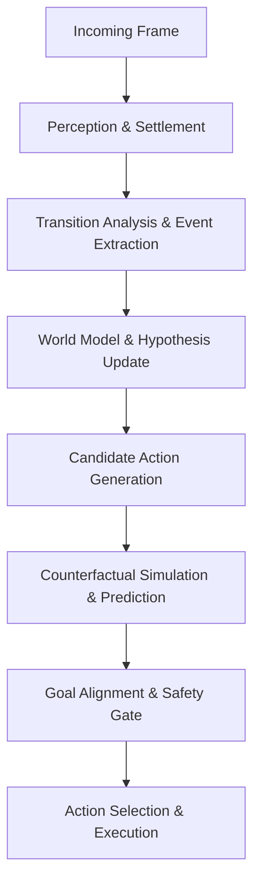

# DEWMA-ARC v4: Current Agent Architecture, Logic & Mechanisms

## 1. Executive Summary & Core Philosophy

The current agent ([`agent/my_agent.py`](file:///c:/Users/mdibr/Desktop/Work_Space_Professional/Kaggle%20Competition/arc-arg-3/GeminiModule/ARC-AGI-3-Kaggle-Starter/agent/my_agent.py)) implements **DEWMA-ARC** (*Developmental Epistemic World-Model ARC*), an autonomous, test-time learning agent specifically designed for the ARC-AGI-3 interactive evaluation benchmark.

### Core Design Tenets:
1. **100% Domain-General**: Zero hardcoding or game-specific branching. Every mechanism operates on visual invariants, geometry, causality, and information theory.
2. **Raw Grid Authority**: The 2D integer grid is ground truth. Derived object abstractions (connected components, bounding boxes) are confidence-weighted and never obscure raw pixel realities.
3. **Epistemic Exploration Before Exploitation**: When the rules of a game are unknown, the agent optimizes for **Expected Information Gain (EIG)**—choosing actions that maximize rule discovery. Once causal models solidify, it switches to goal pursuit.
4. **Offline & Multi-Tier Runtime Budgeting**: Operates entirely self-contained without external internet access, adjusting cognitive depth (from fast heuristic reflex to local simulation) based on remaining clock time.

---

## 2. End-to-End Decision Lifecycle

For every incoming frame from the environment, the agent executes the following pipeline:

### Step-by-Step Flow:
1. **Observation & Settlement**: 
   - Receives multi-frame temporal sequences (settling animations vs transient effects).
   - Extracts background color, active palette, connected components, bounding boxes, and detects if the scene is in **Field Mode** (dense continuous grid) or **Object Mode** (discrete entities).
2. **Causal Attribution & Memory Update**:
   - Compares previous scene $S_{t-1}$ and current scene $S_t$ after executing action $A_{t-1}$.
   - Extracts transition `Event` (pixel change count, topology shifts, appeared/disappeared colors, no-ops, progress, or death).
   - Updates the causal hypothesis engine, spatial action hash, and dead signature registry.
3. **Candidate Proposal Generation**:
   - Generates candidate actions: simple directional actions (`ACTION1`–`ACTION7`) and spatial coordinate clicks (`x, y`).
   - Prioritizes coordinates using geometric priors: rare color anchors, small component centroids, symmetry midpoints, and coarse unexplored frontiers.
4. **Prediction & Scoring**:
   - Computes an epistemic score combining:
     $$\text{Score} = \text{CoordPrior} + 1.2 \cdot \text{SpatialConf} + 0.8 \cdot \text{HypConf} + 0.55 \cdot \text{EIG} + \text{GoalBonus} - 0.55 \cdot \text{TriedCount}$$
5. **Goal Alignment & Execution**:
   - Validates the chosen action against the `GoalAlignmentVerifier` to reject out-of-bounds clicks, known illegal moves, or unprovoked destruction.
   - Commits the action and increments visitation counts.

---

## 3. Detailed Component Breakdown

### A. Perception Engine (`PerceptionEngine`, `Scene`, `Component`)
- **Background Extraction**: Identifies the true canvas color using border dominance and frequency heuristics.
- **Component Clustering**: 4-way/8-way flood fill identifying discrete objects, their bounding boxes, mass centroids, colors, and border contacts.
- **Field Mode Detection**: If components are excessively dense or noisy, automatically marks `scene.field_mode = True` so spatial clicks switch to raw coordinate sampling rather than relying on noisy object masks.

### B. Causal Hypothesis Memory (`HypothesisMemory`)
- Maintains a Bayesian-style distribution over action signatures:
  $$\text{Signature} = (\text{ActionName}, \text{LocalContextHash})$$
- Tracks transition outcomes: `"progress"`, `"death"`, `"noop"`, or `"effect:<hash>"`.
- **Expected Information Gain (EIG)**: When multiple hypotheses compete or when an action signature is untested, assigns high exploratory value to resolve epistemic uncertainty.

### C. Spatial Action Hash (`SpatialActionHash`)
- A fast 2D lookup table caching local transformation rules.
- Captures mechanics like: *"Clicking this specific 3x3 pattern of colors always flips the center cell."*
- Enables instant multi-step planning for recurring physical mechanics without needing expensive neural model inference.

### D. Dead Signatures & Anti-Loop Index (`DeadSignatureIndex`)
- Records action signatures that produce zero effect (strict settled no-ops) repeatedly.
- Evicts unproductive affordances so the agent does not waste action budget in endless repetitive loops.

### E. Candidate Generator & Spatial Probing (`CandidateGenerator`)
Coordinates for spatial click actions (`x, y`) are proposed via several general heuristics:
- **Rare Small Components**: Centroids of small, distinct objects (likely interactive buttons, keys, or players).
- **Component Corners**: Bounding box corners of objects.
- **Recent Change Proximity**: Probing areas where the grid recently animated or changed state.
- **Symmetry / Pair Midpoints**: Midpoints between pairs of identical rare colors (anchoring alignment/connecting mechanics).
- **Coarse Frontier Grid**: Uniform geometric grid spanning the entire board to guarantee total coverage.

### F. Metacognitive Controller & Goal Alignment (`GoalAlignmentVerifier`)
- **Safety & Validity**: Filters out actions that violate grid boundaries or advertised legal actions.
- **No-Op Suppression**: Rejects predicted no-ops unless the agent is actively probing for information.
- **Goal Delta Scoring**: Rewards actions that increase progress tokens, preserve important non-background colors, or advance level completion.

---

## 4. Reset Dynamics & Exploration Logic

### The Role of Death & Resets in Exploration
In ARC-AGI-3, a `GAME_OVER` or `RESET` restarts the current level:
- When a level resets, the agent's spatial visitation map (`coordinate_visits`) is cleared.
- This provides a **clean exploration slate** when the agent reaches a dead end or gets trapped in a local minimum.
- Hard safety constraints that forbid any risky action can unintentionally trap the agent in infinite NOOP loops. Allowing controlled exploration—even if risky—ensures the agent can restart and discover winning trajectories.

---

## 5. Summary of Generalization vs. Diagnostics

| Layer | Design Approach | Purpose |
| :--- | :--- | :--- |
| **Logic & Rules** | **Domain-General** | Relies purely on geometry, visual topology, information theory, and causality. Zero hardcoded game rules. |
| **Diagnostics** | **Game-Focused** | Uses the 25 local benchmark games (e.g. `tn36`, `r11l`, `ka59`) as test cases to verify perception, navigation, and causal learning. |

---

## 6. Next Steps & Active Areas for Improvement

1. **Controlled Stagnation Reset**: Detecting consecutive NOOP loops and intentionally executing `GameAction.RESET` rather than wasting turns.
2. **Multi-Step Program Synthesis**: Increasing the confidence threshold for counterfactual beam search (`CounterfactualPlanner`) to execute multi-action plans once a game mechanic is verified.
3. **Dynamic Frontier Sampling**: Adapting coarse frontier spacing dynamically based on the observed canvas resolution.
